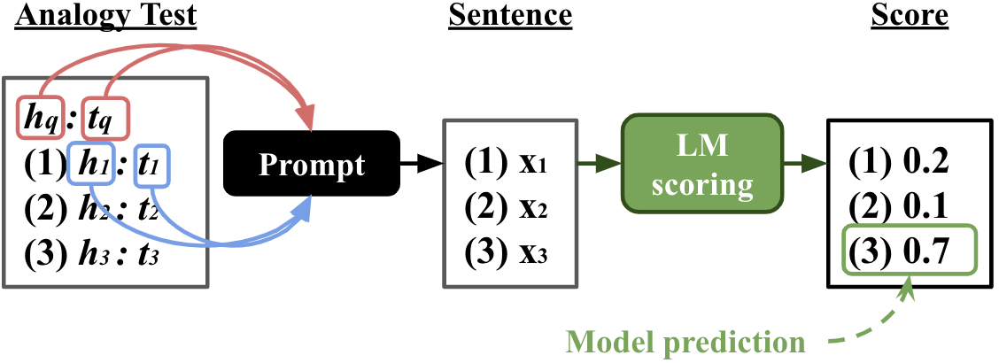

# BERT is to NLP what AlexNet is to CV
This is the official implementation of ***BERT is to NLP what AlexNet is to CV: Can Pre-Trained Language Models Identify Analogies?*** (the camera-ready version is [here](https://arxiv.org/abs/2105.04949))
which has been accepted by **[ACL 2021 main conference](https://2021.aclweb.org/)**. We evaluate pretrained language models (LM) on five analogy tests that follow SAT-style format as below.
```
QUERY word:language
OPTION
  (1) paint:portrait
  (2) poetry:rhythm 
  (3) note:music <-- the answer!
  (4) tale:story
  (5) week:year 
```
We devise a new class of scoring functions, referred to as *analogical proportion (AP)* scores, to solve word analogies in an unsurpervised fashion and investigate the relational knowledge that LM learnt through pretraining.
<p align="center">
  
</p>   

Please see our paper for more information and discussion.

## Get started
```
git clone https://github.com/asahi417/analogy-language-model
cd analogy-language-model
pip install -e .
```

## Run Experiments
The following scripts reproduce our results in the paper.
```bash
# get result for our main AP score
python experiments/experiment_ppl_variants.py 
# get result for word embedding baseline
python experiments/experiment_word_embedding.py 
# get result for other scoring function such as vector difference, etc
python experiments/experiment_scoring_comparison.py 
```
Here's the result summary that can be attained by running those scripts.
- [experimental results](https://github.com/asahi417/alm/releases/download/0.0.0/experiments_results.tar.gz)

## Dataset
The datasets used in our experiment can be donwlodead from the following links:
- [Analogy Test](https://github.com/asahi417/AnalogyTools/releases/download/0.0.0/analogy_test_dataset_no_prediction.tar.gz)
- [Lexical Relation Classification](https://github.com/asahi417/AnalogyTools/releases/download/0.0.0/lexical_relation_dataset.tar.gz)

Please see [the Analogy Tool](https://github.com/asahi417/AnalogyTools) for more information about those dataset and word embedding baseline.

## Citation
Please cite our paper if you use our code or if you re-implement our method:
```
@inproceedings{ushio-etal-2021-bert-is,
    title ={{BERT} is to {NLP} what {A}lex{N}et is to {CV}: {C}an {P}re-{T}rained {L}anguage {M}odels {I}dentify {A}nalogies?},
    author={Ushio, Asahi and
            Espinosa-Anke, Luis and 
            Schockaert, Steven and
            Camacho-Collados, Jose},
    booktitle={Proceedings of the {ACL}-{IJCNLP} 2021 Main Conference},
    year={2021},
    publisher={Association for Computational Linguistics}
}
```
